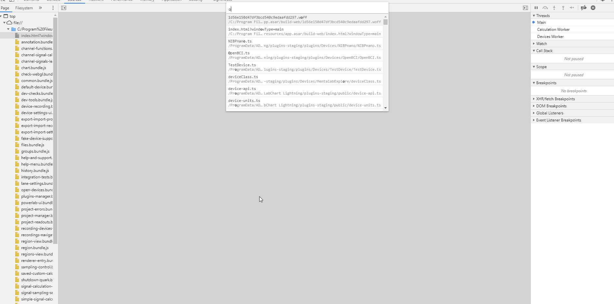
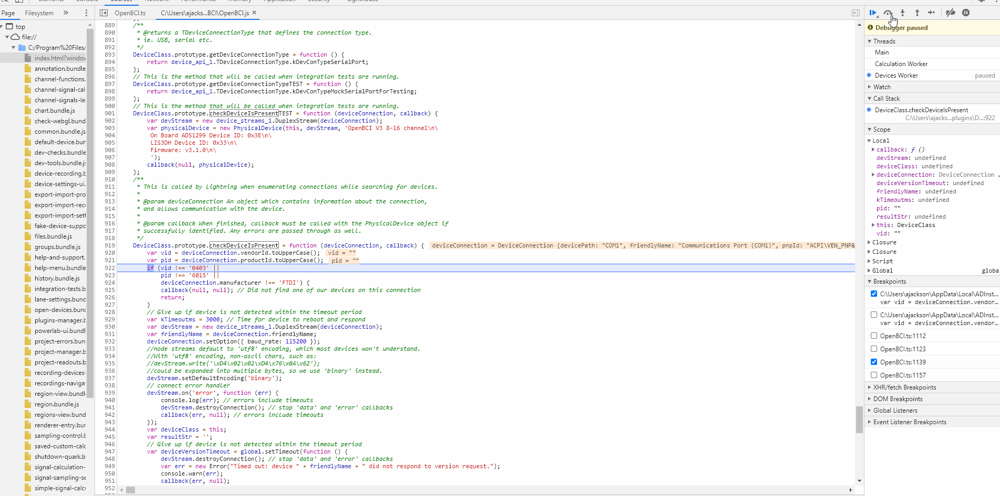

# LightningDeviceSDK Debugging

**The LightningDeviceSDK is currently under development and is subject to change.**

If you're struggling to figure out what is going wrong inside your device script at runtime, one of the best tools at your disposal is the debugger. An alternative is to use console logs. Examples of both are given below.

## Developer Tools Debugger

The developer tools can be found in the Help menu under Toggle Developer Tools.


After the developer tools are opened, navigate to the Sources tab and use the Ctrl/Cmd + P shortcut to open a search bar for your file. **Important:** you will need to look for _yourfilename.js_ not yourfilename.ts as at this point your Typescript files will be complied to Javascript.
E.g. OpenBCI.js

If you have split your file device plugin into multiple files, it will be easiset to search your folder name and then the file you require E.g. MentaLabExplore\proxy.js



The correct files will always be under a folder called Compiled Plugins. E.g. C:\Users\username\AppData\Local\ADInstruments\LabChart Lightning\Compiled Plugins\OpenBCI\plugins\Devices\OpenBCI\OpenBCI.js

Once you've found your file you can put breakpoints on relevant functions such as checkDeviceIsPresent or your onData function to verify outStreamBuffers are being correctly written to.



## Console Logs

Another easy way of debugging your script is to simply add `console.log()` calls to your code. These will appear in the Console tab in the developer tools.

E.g.

```
console.log('inside checkDeviceIsPresent, found our device');
```

or

```
console.log('inside parser. Expecting ECG packet, recieved Temp packet);
```
