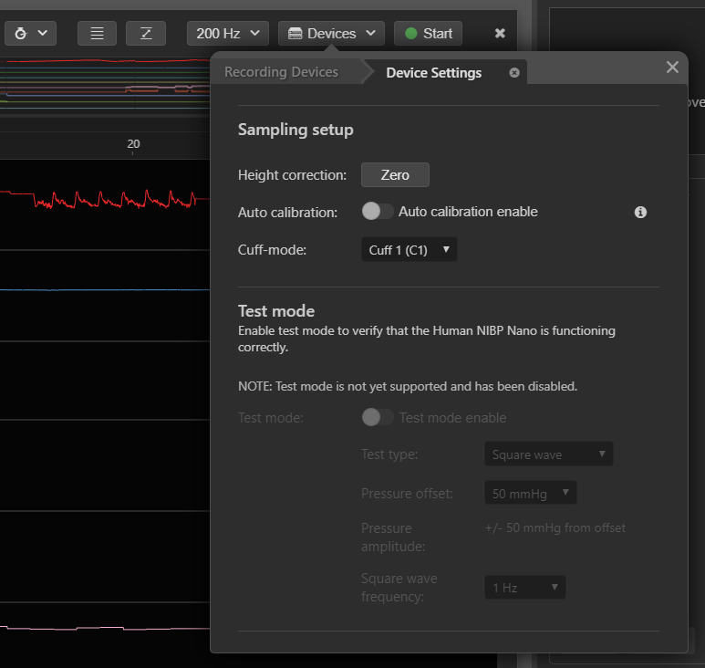
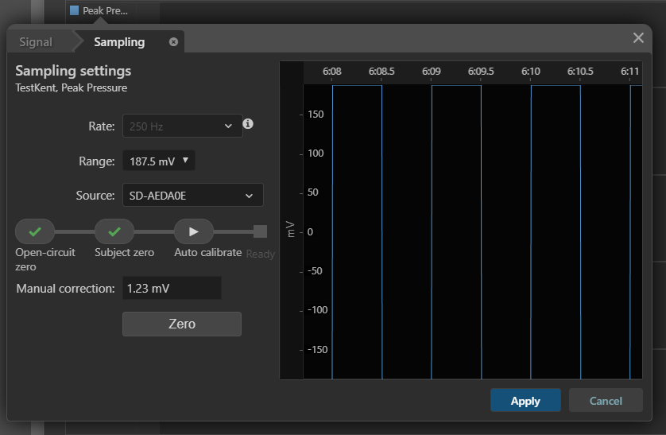
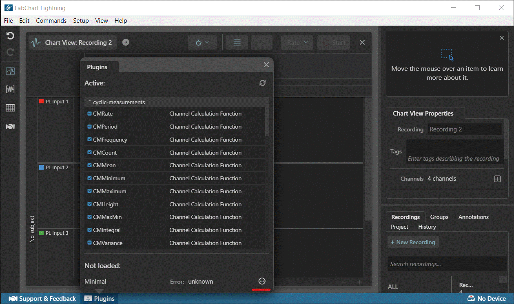

# LightningDeviceSDK Device UI

**The LightningDeviceSDK is currently under development and is subject to change.**

Devices often have options the user can configure prior to sampling that change the device's behavior. For example, a hardware calibration process may need to be performed by the user prior to sampling in order to achieve high accuracy data.

LabChart Lightning allows device plugins to customize certain parts of the software's Graphical User Interface in order to support custom device-specific configuration.

## Customizing Device UI

LabChart Lightning supports two types of customization:
1. Device-wide configuration,
2. Signal-specific configuration.

The following image is an example of device-wide configuration UI as defined in the NIBPNano example:



And the following is an example of custom signal-specific UI for configuring up a signal:



## Device UI Plugins

User Interface for Devices are customized via a plugin.

A Lightning device plugin is defined via a single Typescript (.ts) file located in a specific folder that LabChart Lightning knows to load files from.

Each LabChart Lightning device must export a single `getDeviceUIClasses()` function, e.g.

```ts
module.exports = {
   ...

   // Register custom device UI class.
   getDeviceUIClasses(libs) {
      return [new DeviceUI()];
   }
}
```

Similar to device class registration, LabChart Lightning calls `getDeviceUIClasses()` on startup. This must return an array of objects which Lightning will consider when showing device-related UI to the user.

On launch, LabChart Lightning loads all plugins. If there is a problem loading the plugin, information about the error can be obtained by clicking the (...) button highlighted in red in the image below:



### Device UI Class

```ts
export class YourDeviceUI implements IDeviceUIApi {
   // Identifier for this plugin class. Must be unique across all potential
   // device implementations known to LabChart Lightning.
   name = 'Your Device UI';

   // type is used by LabChart Lightning to identify this plugin class as
   // providing custom device UI.
   type: PluginFeatureTypes = 'Device UI';

   // Must exactly match the string returned from your device class's
   // getDeviceClassName() implementation.
   deviceClassName = 'YourDeviceClass';

   // Returns a description of the UI area to show when configuring the device.
   describeDeviceSettingsUI?: (
      deviceSettings: IDeviceSettingsApi,
      deviceIndex: number,
      deviceManager: IDeviceManagerApi
   ) => IUIAreaApi | undefined;

   // Returns a description of the UI area to show when the user configures
   // an individual signal of the device.
   describeStreamSettingsUI(
      settings: IDeviceStreamSettingsApi,
      deviceIndex: number,
      deviceManager: IDeviceManagerApi
   ): IUIAreaApi {
      ...
   }
}
```

### describeDeviceSettingsUI()

Declares the UI to be shown to users when a user configures the device properties from within the application.

### Example
```ts
describeDeviceSettingsUI(settings) {
   const elements = [];

   elements.push({
      type: 'header',
      title: 'Your device name',
      subtitle: 'Description of the device'
   });

   elements.push({
      type: 'setting',
      setting: settings.autoCalibrate,
      controlType: 'toggle',
      info:
         'Auto-calibration improves accuracy in the arterial blood pressure measurement by providing an ongoing calibration, approximately every 70 beats during longer recordings and more often in the first few minutes of recording.\n\nIt is recommended to enable this setting unless the subject is moving around considerably during recording.',
      disabled: testModeEnabled
   });

   elements.push({
      type: 'setting',
      setting: settings.cuffMode,
      controlType: 'list',
      disabled: testModeEnabled
   });

   // ...

   return {
      elements,
      layout: 'default',
      desiredWidthPixels: 500,
      desiredHeightPixels: 500
   } as IUIAreaApi;
}
```

### describeStreamSettingsUI()

Declares the UI to be shown to users when they access the signal sampling properties from the application.

### Example
```ts
describeStreamSettingsUI(settings) {
   const elements = [];

   elements.push({
      type: 'header',
      title: 'Your device name',
      subtitle: 'Description of the signal'
   });

   // Shows a dropdown list of possible input gains.
   elements.push({
      type: 'setting',
      controlType: 'list',
      setting: settings.inputSettings.range
   });

   // Shows a live display of the sampling signal to the user.
   elements.push({
      type: 'signal-preview'
   });

   return {
      elements,
      layout: 'default',
      desiredWidthPixels: 500,
      desiredHeightPixels: 500
   } as IUIAreaApi;
}
```

## More info

Interface definitions can be found within `public/device-ui-api.ts`.

These interfaces contain type annotations (in Typescript) and are usable in Typescript files. The import path must be relatively the same is in the examples as it is copied directly in-order to compile. E.g. Imports must always be from the path `../../public/device-api`
