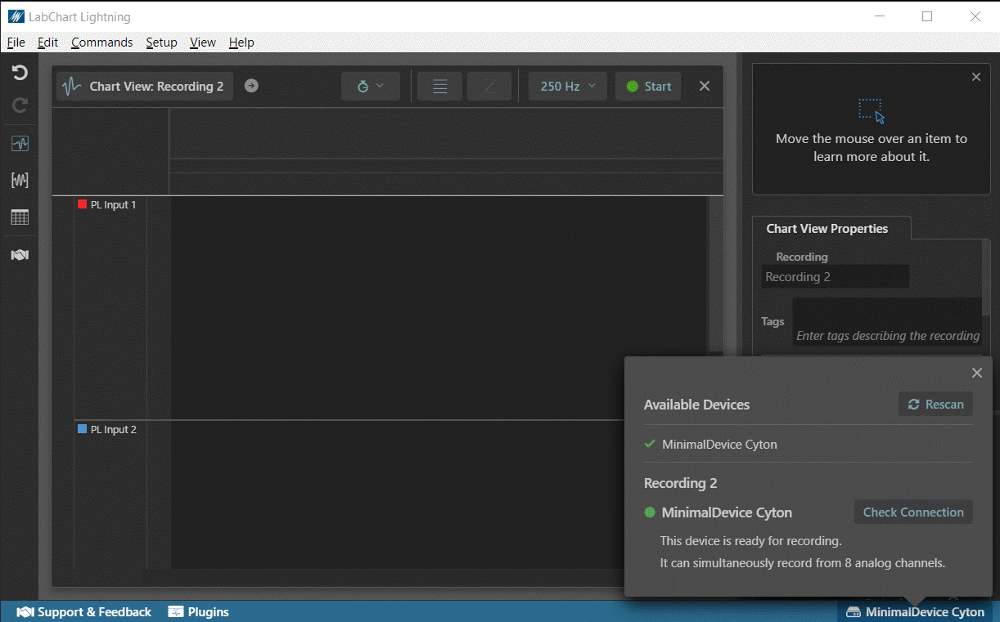
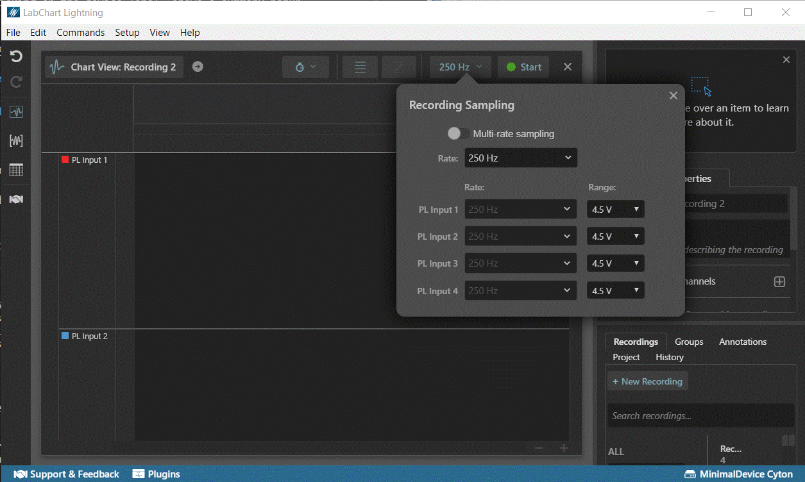

# LightningDeviceSDK Overview

**The LightningDeviceSDK is currently under development and is subject to change.**

## LabChart Lightning Device Plugins

A Lightning device plugin is defined via a single Typescript (.ts) file located in a specific folder that LabChart Lightning knows to load files from.

Each LabChart Lightning device must export a single `getDeviceClasses()` function, e.g.

```ts
module.exports = {
   getDeviceClasses(libs) {
      ...
      return [new DeviceClass()];
   }
}
```

When LabChart Lightning starts, it calls `getDeviceClasses()`. This must return an object array which Lightning can query to discover connected instances of your particular class or classes of device.

On launch, LabChart Lightning loads all plugins. If there is a problem loading the plugin, information about the error can be obtained by clicking the (...) button highlighted in red in the image below:


## Anatomy of a Device Plugin

There are three main building blocks to a Lightning-compatible device:

1. Device class
2. Physical device
3. Proxy device

The **Device class** corresponds to a single conceptual class or category of devices, e.g. PowerLab.

The **Physical device** represents a single, active hardware device - already connected to the computer and able to sample data into LabChart Lightning.

The **Proxy device** represents a single device _within the context of a LabChart Lightning recording_. Manages the device settings and access to sampling for that recording.

These interfaces must be implemented for the device plugin to be loaded into Lightning.

### Device class (`device-api.ts : IDeviceClass`)

A singleton representing a single, closely-related class of devices that are Lightning-compatible.

As an example, consider the ADInstruments PowerLab hardware range: a single PowerLab class provides support for multiple PowerLab models (e.g. PowerLab 8/35 with 8 analog inputs vs PowerLab 2/26T supporting only 2 analog inputs) with varying capabilities. The reason we would typically choose to define a single PowerLab class to represent multiple models is that it allows a sampling setup created with a PowerLab 4/26T can be easily used by, say, another user on a different computer who only has access to a PowerLab 4/35.

### Physical device (`device-api.ts : OpenPhysicalDevice`)

An object that is a representation of the connected hardware device. It abstracts away the details of how Lightning interacts with the hardware or hardware API. Multiple LabChart Lightning recordings can use the same PhysicalDevice, but only one can sample with that device at any time.

#### Creation

A **Physical device** instance is typically created by the **Device class** during application device scan in response to successful connection to the underlying hardware. Created instances will be reused during subsequent scans. i.e. A new instance will only be created for new connections when, say, the user connected another device and performed a hardware rescan.

Physical devices are only destroyed once the application closes.

### Proxy device (`device-api.ts : IProxyDevice`)

An object that is created for each recording to represent the PhysicalDevice in that recording. Manages the device settings and access to sampling for that recording.

#### Creation

A **Proxy device** instance is created when both:

1. There is an active recording open in LabChart Lightning.
2. A working physical device is present.

Proxy devices are destroyed each time a recording the application closes.

## Example Scenarios

To better understand the role of the various objects in the plugin implementation, consider the following scenarios:

#### Scenario 1 - Attach a device and launch LabChart Lightning

1. On launch, LabChart Lightning loads all plugins, calling `getDeviceClasses()` which returns an instance of the plugin DeviceClass implementation. e.g. `[return new DeviceClass()];`
2. Shortly after, Lightning initiates a device scan process. For each serial device returned by the operating system, `checkDeviceIsPresent(deviceConnection, callback)` is called on the DeviceClass implementation. If the vendor, product and manufacturer information for the connection match the expected values for the target device a new Physical device object is instantiated and returned to LabChart Lightning via callback.
3. If a device was found, a new recording will be added to the project and a Device proxy for the found physical device will be created. The detected device will be shown in the bottom right corner of the application. Clicking on the device label, shows a summary popup as in the image below:



#### Scenario 2 - User adjusts the device's sampling rate

Nearly all user interactions with a device in LabChart Lightning are performed on the proxy (not the physical device itself). When the sampling rate is adjusted via the User Interface, the device plugin's proxy implementation is responsible for:

1. Telling LabChart Lightning about the new settings via `setupDataInStream()` for each of the affected input streams.
2. Communicating the change to the actual hardware.

LabChart Lightning will then ensure settings changes are persisted across runs of the application.



## Examples

**`examples/devices/SerialSettings.ts`**

* A serial device whose parser is based on the OpenBCI protocol
* Exposes two user configurable settings: sampling rate and gain for each produced data stream.
* Signal sampling settings UI is described within `SerialSettingsUI.ts`

**`examples/devices/SerialSettingsWithMappedInputs`**

* A serial device whose parser is based on the OpenBCI protocol
* Exposes two user configurable settings: sampling rate and gain for each produced data stream.
* `SerialSettingsUI.ts` contains example showing how to add a list element to the signal sampling settins UI for choosing which device input will be recorded from.

## More info

Interface definitions can be found inside the `public` folder.

These interfaces contain type annotations (in Typescript) and are usable in Typescript files. The import path must be relatively the same is in the examples as it is copied directly in-order to compile. E.g. Imports must always be from the path `../../public/device-api`

The baud rate is currently set to 115200 for all devices.