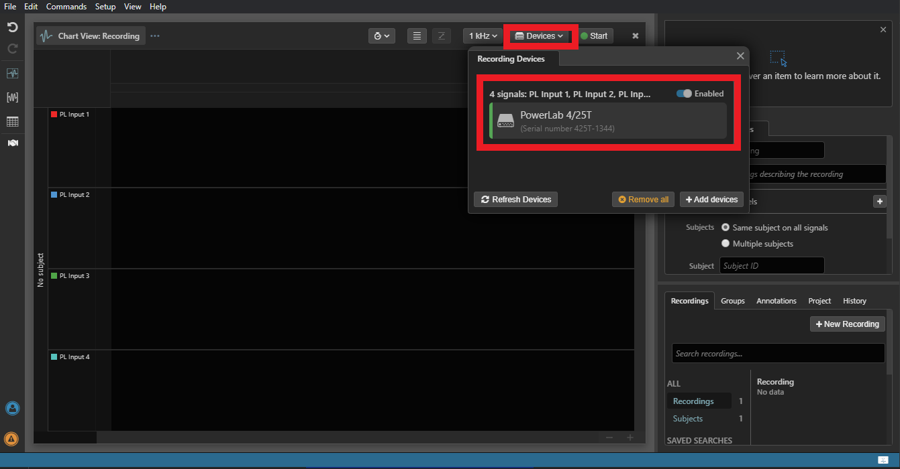

# LightningDeviceSDK Overview

**\*\*The LightningDeviceSDK is currently under development and is subject to change.\*\***

## LabChart Lightning Device Plugins

A Lightning device plugin can be defined via a single Typescript (.ts) file. If you have not yet set up your development environment consider reading the [readme](README.md) and [setup](SETUP.md) documentation.

In this document we give a brief introduction. A more detailed explanation exists in [this infographic](SDK_infographics_v2.01.pdf) document.

You can also find complete plugin script examples in [.\examples\devices](.\examples\devices).

<br/>

## Anatomy of a Device Plugin

Your plugin file must contain three essential building blocks:

1. Device class
2. Physical device
3. Proxy device

The required interface for these classes can be found in [.\public\device-api.ts](public\device-api.ts).

<br/>

## Device class (`device-api.ts : IDeviceClass`)

An object representing a closely-related class or catagory of devices that are Lightning-compatible.

As an example, consider the ADInstruments PowerLab hardware range. A single PowerLab device class provides support for multiple PowerLab models (e.g. PowerLab 8/35 with 8 analog inputs vs PowerLab 2/26T supporting only 2 analog inputs) with varying capabilities. Using a single PowerLab class to represent multiple PowerLab models gives users greater flexibility. For example, it allows a sampling setup created with a PowerLab 8/35 to be used by another user on a different computer who only has access to a PowerLab 2/26T.

In the setup documentation [setup](SETUP.md) you saw a very basic example:

```ts
export class DeviceClass {
    constructor() {
        console.log('In the constructor');
    }
}

module.exports = {
   getDeviceClasses() {
      ...
      return [new DeviceClass()];
   }
}
```

By exporting the getDeviceClasses() method, this `DeviceClass` is now registered with Lightning. When Lightning launches, this and all other registered `DeviceClass` objects are compared to the any detected hardware.

To make this comparison your `DeviceClass` class must contain a `checkDevicesIsPresent()` method. Lightning calls this method and passes it a `deviceConnection` object. That object will contain device information such as a vendor ID or a product ID.

```ts

// now implementing the API
export class DeviceClass implements IDeviceClass {
    // ...

    checkDeviceIsPresent(
        deviceConnection: DuplexDeviceConnection,
        callback: (error: Error | null, device: OpenPhysicalDevice | null) => void
    ): void {

        const vid = deviceConnection.vendorId.toUpperCase();
        const pid = deviceConnection.productId.toUpperCase();
        let deviceName = '';
        if (vid === '16C0' && pid === '0483') {
            deviceName = 'YourDeviceName';
        }

        // now make a PhysicalDevice object - more on this below
```

<br/>

If you were to log out the `deviceConnection` object in the dev tools then you will see something like this in the console tab:


Here we can see the vendorID and productID.

<br/>

A relatively simple `deviceClass` example exists in [.\examples\devices\Teensy_4_1\Teensy_4_1.ts](examples\devices\Teensy_4_1\Teensy_4_1.ts).

Depending upon how your device sends data, this `checkDeviceIsPresent()` may need access to a parser object. See [.\examples\devices\MentalabExplore\deviceClass.ts](examples\devices\MentalabExplore\deviceClass.ts) for a more complex example.

If Lightning determines that a match exists, it will then ask the `DeviceClass` to generate a `physicalDevice` object.

<br/>

## Physical device (`device-api.ts : OpenPhysicalDevice`)

The **physical device** represents your hardware; a single, active hardware device that is already connected to the computer.

It abstracts away the details of how Lightning interacts with the hardware or hardware API. Multiple LabChart Lightning recordings can use the same PhysicalDevice, but only one can sample with that device at any time.

A physical device instance is typically created by the **Device class** during application device scan in response to successful connection to the underlying hardware. Created instances will be reused during subsequent scans.

Physical device objects are only destroyed once the application closes.

Other than access to constants, you should not often need to access the `physicalDevice`. Instead, the `proxyDevice` will handle sampling settings and interface with the `physicalDevice`. `proxyDevice` is discussed in the next section.

A simple stand alone `physicalDevice` example exists for Arduino devices in
[public\arduino-physical-device.ts](public\arduino-physical-device.ts).

<br/>

## Proxy device (`device-api.ts : IProxyDevice`)

Recordings in Lightning are similar to files, and each recording may have different sampling or device settings. So a separate `proxy device` object is created for each recording, which then supplies recording specific device settings back to the `physical device`. This ensures, for instance, that the physical device always uses the settings from the correct recording when sampling.

Therefore, a **Proxy device** instance is created when both:

1. There is an active recording open in LabChart Lightning.
2. A working physical device is present.

Proxy devices are destroyed each time a recording or the application closes.

It is within `proxyDevice` that important sampling and hardware updates must be implemented. Please refer to the [device API](public\device-api.ts).

`proxyDevice` objects also have access to sampled data for their associated recording. As such, they may also need to access a parser.

One complete but simple packet parser example exists at [public\packet-parser.ts](public\packet-parser.ts). Incoming bytes are passed to the `onData()` method. That method then calls a method to process the buffer, which acts as a finite state machine.

The way you process the buffer will depend upon the characteristics of your data packet. For example, in (examples\devices\MentalabExplore\parser.ts)[examples\devices\MentalabExplore\parser.ts] a new packet code is found at the end of the packet.

In a [typical proxydevice file](examples\devices\MentalabExplore\proxy.ts) you will see a number of supporting classes. These include `InputSettings` (range, speed, and units) which are then passed into `StreamSettings`. You can also see supporting gain settings in (examples\devices\MentalabExplore\settings.ts)[examples\devices\MentalabExplore\settings.ts].

A simpler example of both settings and `proxyDevice` in one file can be found at (development\devices\Teensy_4_1\proxyDevice.ts)[development\devices\Teensy_4_1\proxyDevice.ts].

Of note, is the following settings object. It creates a conversion from your raw data into the format that will be displayed in Lightning.

<br/>

```ts
const kUnitsForGain = new UnitsInfoImpl(
   'V', //unit name
   UnitPrefix.kMilli, //unit prefix
   kDefaultDecimalPlaces,
   // Unit conversion
   posFullScaleVAtGain, //maxInPrefixedUnits
   0x7fff, // maxInADCValues based on 0x7fff for 16 bit
   -posFullScaleVAtGain, //minInPrefixedUnits
   -0x7fff, //-0x7fff, //minInADCValues
   0x7fff * 1.5, //maxValidADCValue
   -0x7fff * 1.5 //minValidADCValue
);
```

### Data Formats

A number of data formats are supported in Lightning but by default it will use a 16-bit integer format. This can be changed by specifying a different format in the DeviceStreamConfigration object for stream. If your device doesn't return 16-bit integers then it also needs to specified when creating StreamRingBufferImpl's in prepareForSampling, this is passed back for you by Lightning.

See NIBPnanoFloatingPoint for a complete example. In this example, values from the device are a scaled prefixed integer value e.g. 1/10 mmHg vs mmHg.

Usage example:

```ts
class DeviceStreamConfiguration implements IDeviceStreamConfiguration {
   unitsInfo: UnitsInfo;
   dataFormat: BlockDataFormat;
   constructor(posFullScaleV: number) {
      this.unitsInfo = unitsFromPosFullScale(posFullScaleV);
      this.dataFormat = BlockDataFormat.k16BitBlockDataFormat;
   }
}
```

```ts

prepareForSampling(
   bufferSizeInSecs: number,
   streamDataFormats: BlockDataFormat[]
) {

// Other prepare code

// Buffer creattion
this.outStreamBuffers.push(
   new StreamRingBufferImpl(index, nSamples, streamDataFormats[index])
);

}
```

Other options are:

```ts
enum BlockDataFormat {
   k12BitBlockDataFormat
   k16BitBlockDataFormat
   kFloatBlockDataFormat
}
```

<br/>

## Example Scenarios and Summary

To better understand the role of the various objects in the plugin implementation, consider the following scenarios:

<br/>

#### Scenario 1 - Attach a device and launch LabChart Lightning

1. On launch, LabChart Lightning loads all plugins, calling `getDeviceClasses()` which returns an instance of the plugin DeviceClass implementation. e.g. `[return new DeviceClass()];`
2. Shortly after, Lightning initiates a device scan process. For each device returned by the operating system, `checkDeviceIsPresent(deviceConnection, callback)` is called on the DeviceClass implementation. If the vendor, product and manufacturer information for the connection match the expected values for the target device a new Physical device object is instantiated and returned to LabChart Lightning via callback.
3. If a device is found, a `deviceProxy` for the found physical device will be created for that recording. Clicking on the Devices button at the top of the Chart View shows the connected device and a summary in a popup, as in the image below:



<br/>

#### Scenario 2 - User adjusts the device's sampling rate

Nearly all user interactions with a device in LabChart Lightning are performed on the proxy (not the physical device itself). When the sampling rate is adjusted via the User Interface, the device plugin's proxy implementation is responsible for:

1. Telling LabChart Lightning about the new settings via `setupDataInStream()` for each of the affected input streams.
2. Communicating the change to the actual hardware.

LabChart Lightning will then ensure settings changes are persisted across runs of the application.


## Further examples included with the SDK

**`examples/devices/SerialSettings.ts`**

-  A serial device whose parser is based on the OpenBCI protocol
-  Exposes two user configurable settings: sampling rate and gain for each produced data stream.
-  Signal sampling settings UI is described within `SerialSettingsUI.ts`

**`examples/devices/SerialSettingsWithMappedInputs`**

-  A serial device whose parser is based on the OpenBCI protocol
-  Exposes two user configurable settings: sampling rate and gain for each produced data stream.
-  `SerialWithMappedInputsUI.ts` shows how to add a list element to the signal sampling settings UI for choosing which device input will be recorded from.

**`examples/devices/Teensy_4_1`**

-  Two different timer options are available, a simple interrupt and then a direct connection the ADC.

<br/>

## More info

Interface definitions can be found inside the `public` folder.

These interfaces contain type annotations (in Typescript) and are usable in Typescript files. The import path must be relatively the same as in the examples, as it is copied directly in-order to compile. E.g. imports must always be from the path `../../../public/device-api`

The baud rate is currently set to 115200 for all devices.
