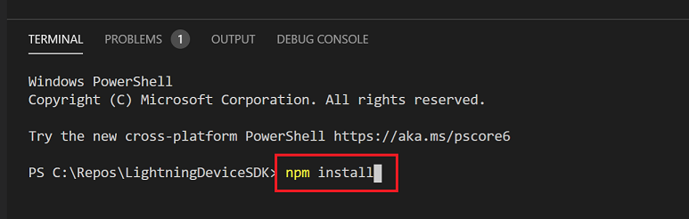
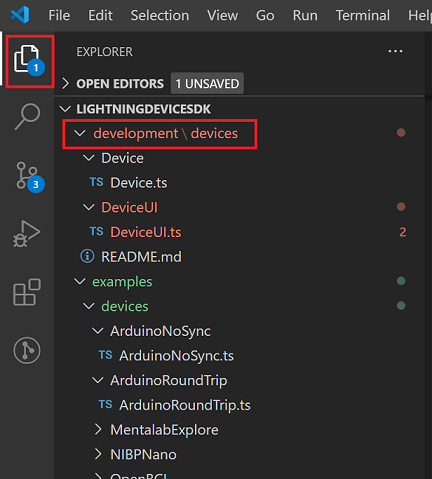

# LightningDeviceSDK

The LightningDeviceSDK allows hardware manufacturers and researchers to connect their data aquisition devices to LabChart Lightning. This is accomplished by writing plugin software using [Typescript](https://www.typescriptlang.org/). 

This repository does not provide any functionality, only example files and typed interfaces. You will need LabChart Lightning with a valid license in order to run your device plugin and connect your device.

[Get LabChart Lightning](https://go.adinstruments.com/integrationLCLtrial). Take advantage of our free 30 day trial while you are in the setup phase of your plugin.

[Find out more](https://go.adinstruments.com/LCLIntegrationCWS). Benefits of integrating with LabChart Lightning and options for enhanced promotion and sales growth opportunities.

[Tell us about yourself](https://go.adinstruments.com/l/21302/2020-09-17/5qnltg). If you would like notifications regarding new resources and opportunities, such as promoting your device to researchers, then please fill out our contact form.


**\*\*The LightningDeviceSDK is currently under development and is subject to change.\*\***

### Supported Device Classes

-  Serial
-  Bluetooth over Serial (Serial Port Profile)
-  More to come...

<br/>

## Change Log

See [Changelog](CHANGELOG.md).

<br/>

## Upcoming Features

-  Better than 10 microsecond inter-device synchronization over USB for Microchip ARM SAMD51 and SAMD21 based devices (e.g. Adafruit Feather M4, M0 etc. and  Sparkfun Thing+ SAMD51)
-  Calling arbitrary proxy functions from custom UI
-  Plugins work for non-admin users 
-  Better error messaging

<br/>

## Getting Started

### Minimum Requirements

-  LabChart Lightning
-  A text editor

### Recommended Device Development Workflow and Initial Setup

When starting out, it is useful to be able to detect possible device implementation errors early, plus make and test improvements rapidly. Therefore, it is strongly recommended to do the following.

Install the needed dependencies:

-  Node.js - https://nodejs.org/en/download/
-  Visual Studio Code - https://code.visualstudio.com/download
   -  Install VS Code extension: ESLint

If you're developing Arduino firmware:
- Arduino IDE - https://www.arduino.cc/en/Main/Software
   - Arduino core(s) for the intended board(s)
   - For best possible time synchronization between devices over USB, we recommend SAM51 based boards, e.g. (e.g. Adafruit Feather M4 etc. and  Sparkfun Thing+ SAMD51)
   - Optionally, the Arduino extension for Visual Studio Code
   - firmware examples for several boards exist in [examples\firmware](examples\firmware).

Clone this repo to your working environment

At the command line, install packages that will assist with development:

```
$ npm install
```

Note: `npm` is the Node Package Manager which comes with Node.js and should already be installed with the steps above.

If you are using Visual Studio Code you can open a terminal from the `Terminal` menu:


And then run `npm install`:



<!-- 
If you want images to work on a non-master branch then you need a full url

 -->


In order for your plugin file to be loaded by Lightning it must be placed into the following location: 

(Windows)  
`C:\Users\[USERNAME]\Documents\LabChart Lightning\Plugins\Devices`

(MacOS)  
`~/Documents/LabChart Lightning/Plugins/devices`

However, to speed up development you can instead work within your current location. Focusing in on the top left of VS Code you also can see an explorer button. Clicking on that button will allow you to see the structure of the project, and in particular, the `./development/` directory.

<br/>




The above image shows the path to an example device plugin file: 

`./development/devices/Device/Device.ts`

Then run `npm run watch` in your terminal.

```
npm run watch
```

This watches for any changes to `.js` or `.ts` files located under `./development/`, automatically copying the updated file(s) to the above mentioned `Documents/LabChart Lightning/Plugins/` directory. In this way you an see the resulting changes as early as possible, and therefore speed up development.

Note: LabChart Lightning must be relaunched to re-compile device plugin files.

<br/>

## More Setup Steps

[Here](SETUP.md), you can go a little deeper and make sure that your plug-in file is being detected, and that you can find compilation errors.

<br/>

## Overview

Once your environment is set, you'll need an [overview](OVERVIEW.md) of the requirements for a device plug-in file.

<br/>

## Advanced Topics

Customizing Lightning's [user interface](DEVICE-UI.md) for your device.

Inter-device time synchronization [time synch](TIME-SYNCH.md).

<br/>

## License

[BSD 3-Clause Clear](LICENSE)
