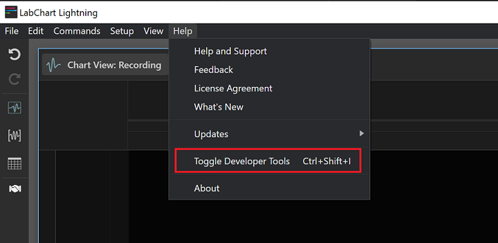
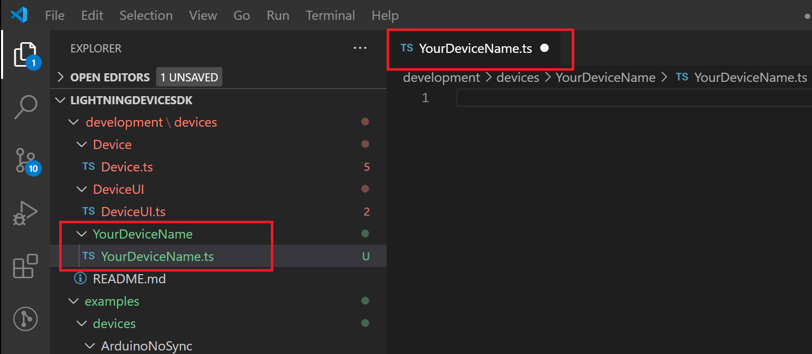
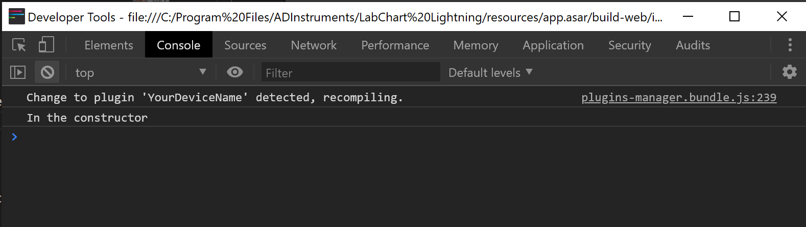
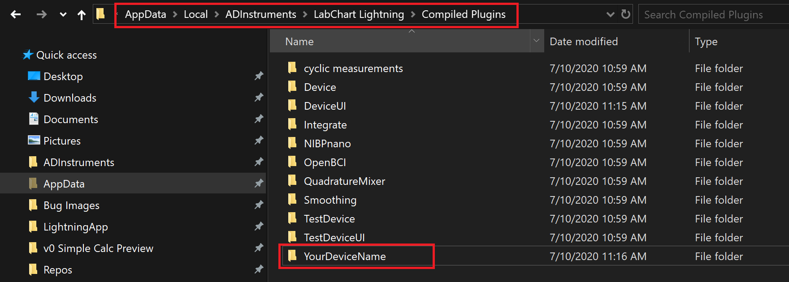
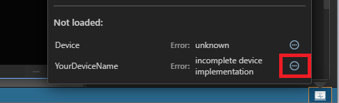
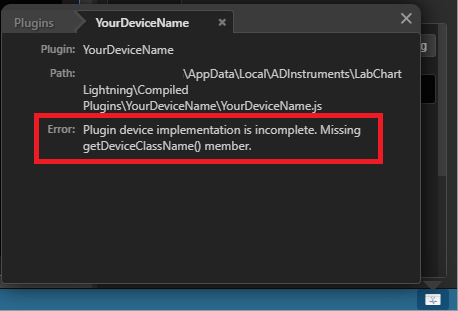

# Further setup checks and familarization

Now is probably a good time to launch Lightning and the "devtools".

Once Lightning is running, you can use the help menu to toggle the developer tools:



You can then capture logging under the console tab.

As a setup check, we can now make a very simple (and very incomplete plugin file).

First, let's create a file in `./development/devices/YourDeviceName/YourDeviceName.ts`




And, with `npm run watch` continuing to run in the terminal, we can check that a `.ts` file has been automatically generated in `Documents`


Any device plugin file must implement a `DeviceClass`. You can find out more about this class in the example files, but essentially it represents all devices of a type or class. Lightning creates a list of these and compares them with those devices attached to a computer.

Paste the following into YourDevice.ts:

```
export class DeviceClass {

    constructor() {
        console.log('In the constructor');
    }

}

module.exports = {
    getDeviceClasses() {
       return [new DeviceClass()];
    }
};
```

In VS Code it should look like this:


If we reload Lightning, and have the dev tools open, we can see this in the console:



This means that the typescript compiler has generated a javascript (`.js`) file from our `.ts` file. It also means that this resultant `.js` file is now ready to be consumed in a final location:

`~\AppData\Local\ADInstruments\LabChart Lightning\Compiled Plugins` (Windows)

`~/Library/Application Support/ADInstruments/LabChart Lightning/Compiled Plugins` (Mac)

Here is the Windows location:



However, if we were to attempt to connect our device we would find that this plugin file is incomplete. We can find out more if we click on the `Manage plugins` button, on the bottom-right of Lightning.


We can see that `YourDeviceName` has not loaded. We can further click on the `Show more` or ellipsis button.



A new tab appears with an error message:



As you develop your plugin this will be a useful place to check for errors.

[Here](OVERVIEW.md), you can see the structure of a device plugin file.  
  


<!-- 

In this case we have not correctly implemented the IDeviceClass interface. You can find this and other interfaces in `device-api.ts`:

 -->


Note: **The LightningDeviceSDK is currently under development and is subject to change.**

